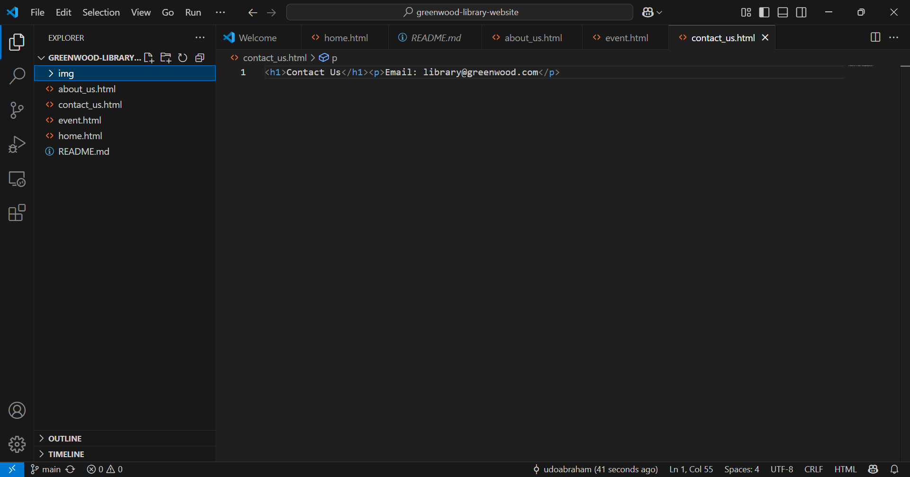
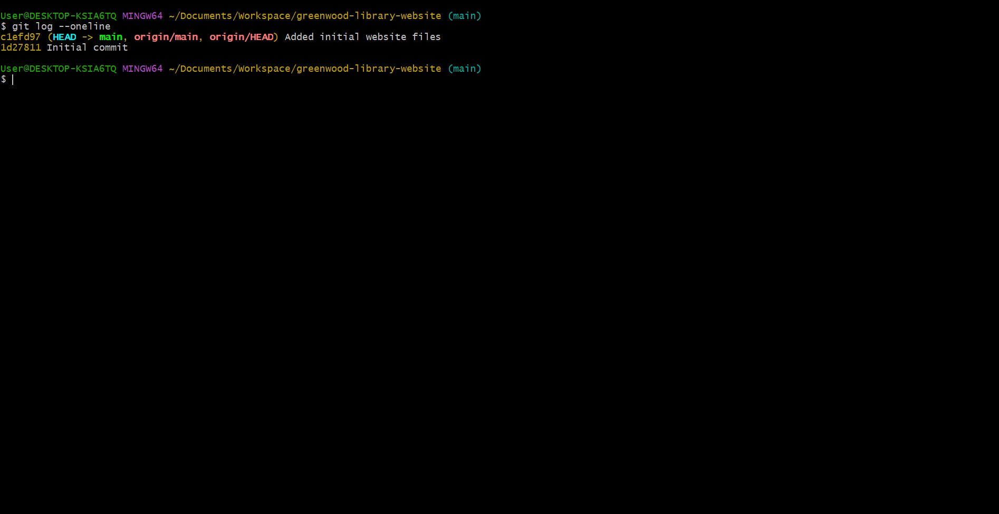
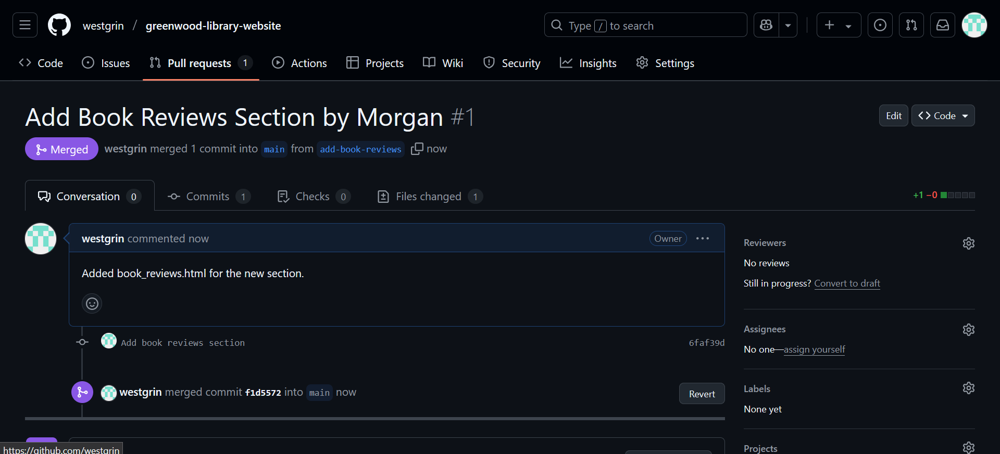
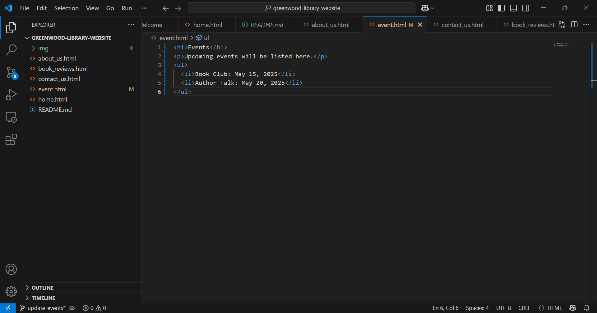
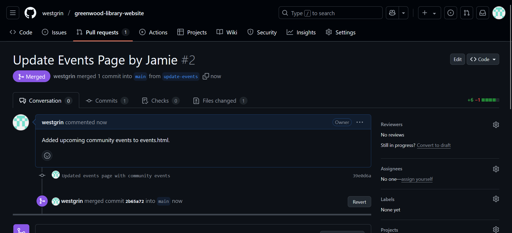

# greenwood-library-website
# CapStone Project: Enhancing a Community Library Website

## Project Overview
This project enhances the Greenwood Community Library website by adding a "Book Reviews" section (Morgan) and updating the "Events" page (Jamie), using Git and GitHub for collaboration.

## Steps Taken

### Setup
- Created a GitHub repository: `greenwood-library-website`.
- Cloned the repository using Git Bash: `git clone https://github.com/westgrin/greenwood-library-website.git`.
- Created initial files in `main` using VS Code:
  - `home.html`: Welcome page
  - `about_us.html`: About the library
  - `events.html`: Events placeholder
  - `contact_us.html`: Contact info

- Staged, committed, and pushed: "Added initial website files".

- Initial commit history:

  

### Morgan’s Work: Adding Book Reviews
- Created branch: `add-book-reviews`.

- Added `book_reviews.html`
- Staged, committed: "Add book reviews section", and pushed.

- Created and merged a pull request on GitHub.
- Morgan’s commit history:

- Morgan’s merged PR:

 

### Jamie’s Work: Updating Events Page
- Created branch: update-events.

- Updated events.html with new events:

- Pulled latest changes from main, staged, committed: "Updated events page with new community events", and pushed.

- Created and merged a pull request.
- Jamie’s commit history:

- Screenshot: Jamie’s merged PR:
Jamie's Merged PR

### Tools Used
- Git Bash: For Git operations (cloning, branching, committing, pushing).

- VS Code: For editing files and creating      documentation.

- GitHub: For hosting the repository and managing pull requests.

### Lessons Learned
- Branching isolates contributions in collaborative projects.

- Pull requests ensure safe integration of changes.

- Updating branches before merging minimizes conflicts.

### Repository Link
[GitHub Repository](https://github.com/westgrin/greenwood-library-website/blob/main/README.md)

### Conclusion
This project successfully enhanced the library website, demonstrating effective use of Git for teamwork and version control.

